# 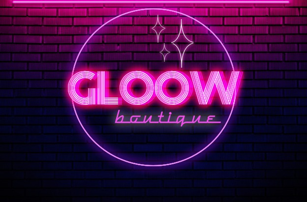

## HACKING CHALLENGE NAGARRO

##   Table of Contents

+ [Brand](#brand)
    - About Our Problematic
    - Startup
+ [Planning](#planning)
  - GitHub's Flow
  - Technologies
+ [Design](#design)
    - Prototype
    - Proposal Design
    - Functional Design Document (FDD)
    - Finished Product
+ [Authors](#authors)
+ [Aknowledgments](#aknowledgments)

## Brand

###  Problematic

##### The principle of our company is to solve 2 problems

 **1.** Why would users want to use a new clothing app, if there are thousands on the market for highly established companies?

**2.** Why do we have to spend so much money on expensive dresses or suits, and wear them only once in a lifetime, and then leave them in our closets?

**3.** Using the same boring clothes because we don't have much capital to buy new ones.

### Startup

##### We created Gloow to solve these 2 problems

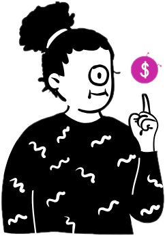 **Gloow clothing store** allows you to buy clothing stores and accessories, but also allows you to return used items that were purchased at Gloow and exchange them for Gloow coins.

With Gloow coins, our users will be able to buy new items, and they will always be able to buy new ones.

---

###  Bussines Model

Maybe the idea that people can return items may seem crazy, but our business model is as follows:

 1. Customers will only be able to return the items they are premium users and if they bought at Gloow, which ensures a repurchase on our page.

2. Only items that comply with the return policies can be exchanged for Gloow points. 

 3. Where do the returned items go?
These will be for sale at Gloow Bazar, where our customers will also be able to use their Gloow points and will be able to purchase quality products at a low price, but with the non-return policy.

## Planning

###  Code Structure Diagram

### GitHub's Flow

 

### Technologies

- ES6
- HTML5
- CSS3
- React
- Hooks (useState, useEffect, useContext)
- React-router-dom
- Fetch
- Bootstrap
- Reactstrap
- Testing-library/react (JEST-dom)
- Postman
- .editorconfig
- Git Workflow
- Github Issues, Projects & Milestones.
- Kanvan
- Figma
- Photoshop
- Google Analytics
- Facebook developers

## Design

###  Prototype

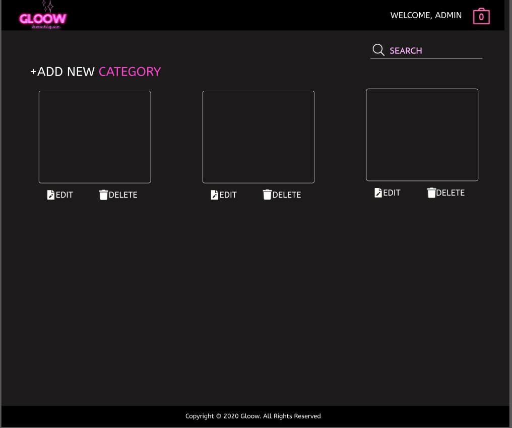

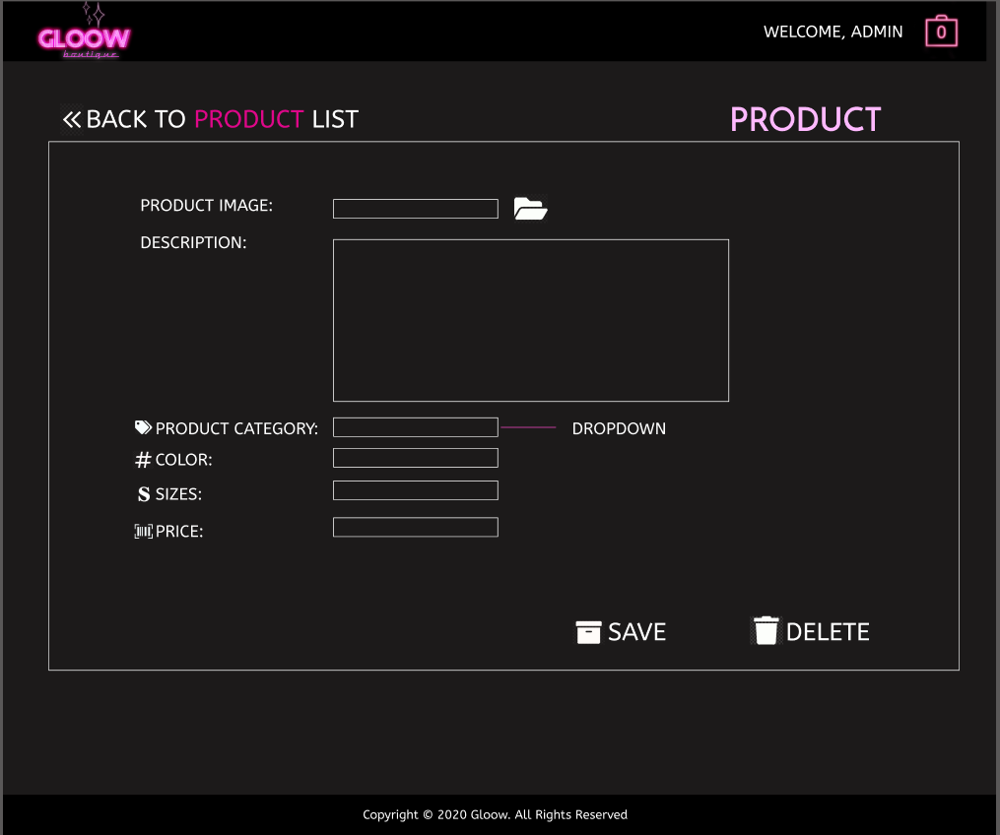
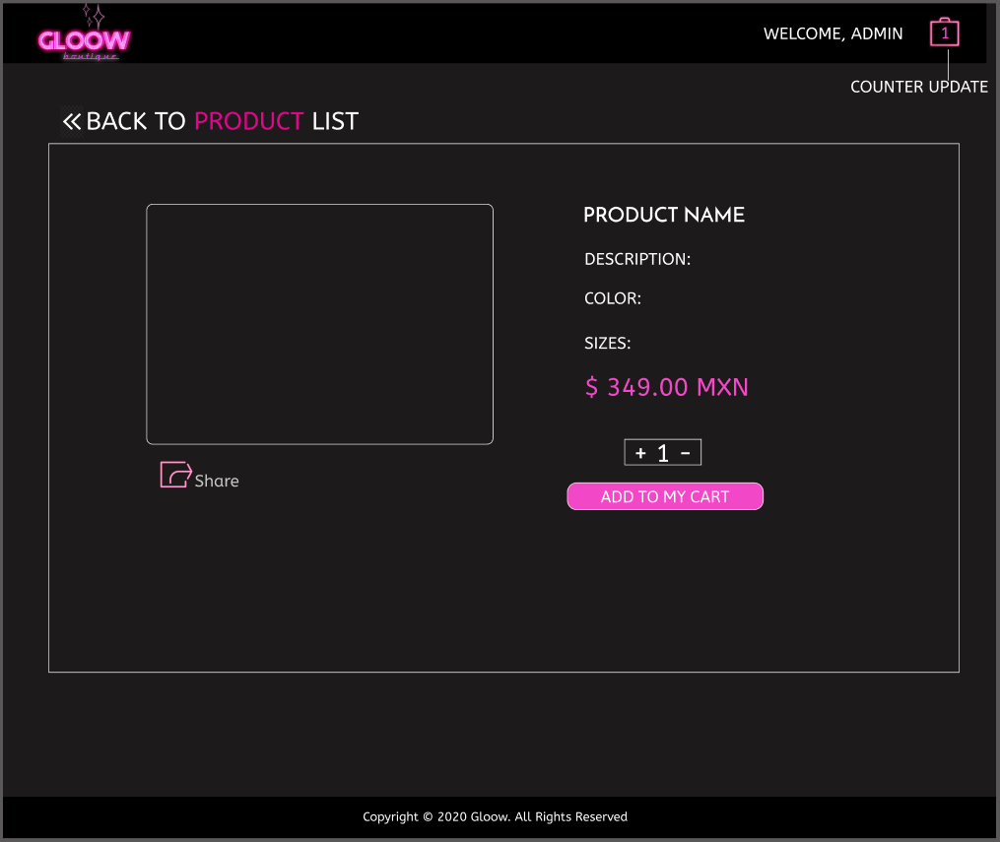
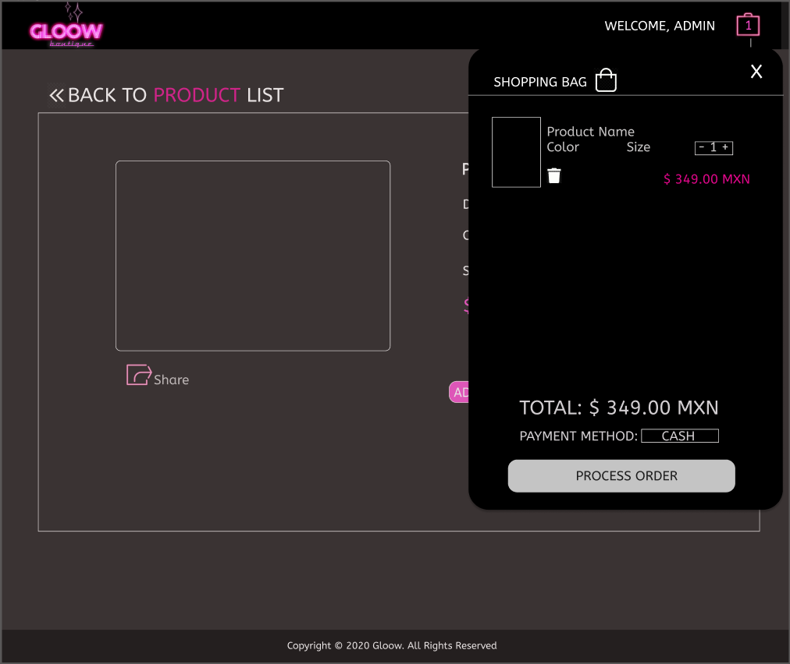

###  Proposal Design

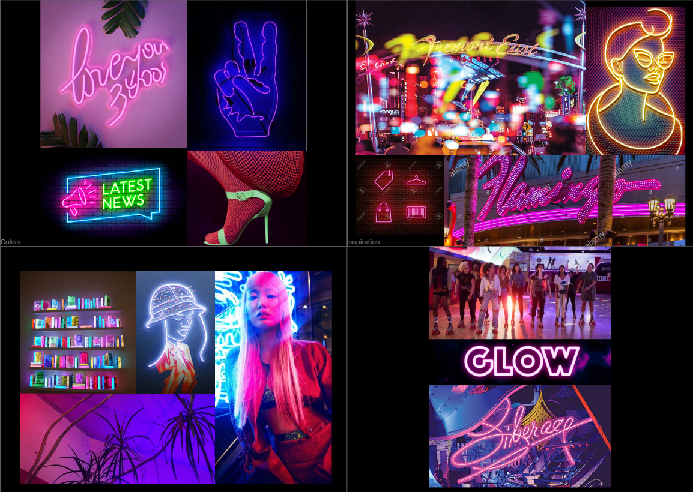
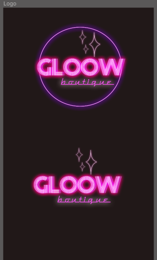
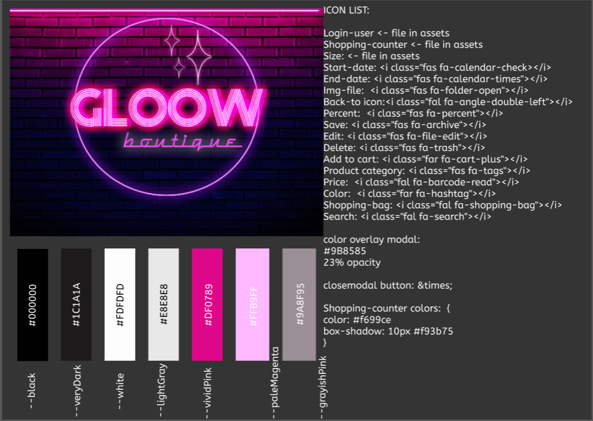
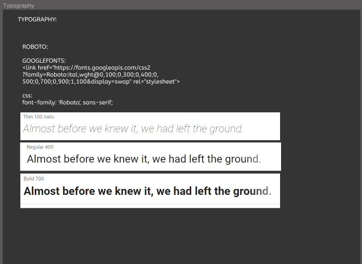
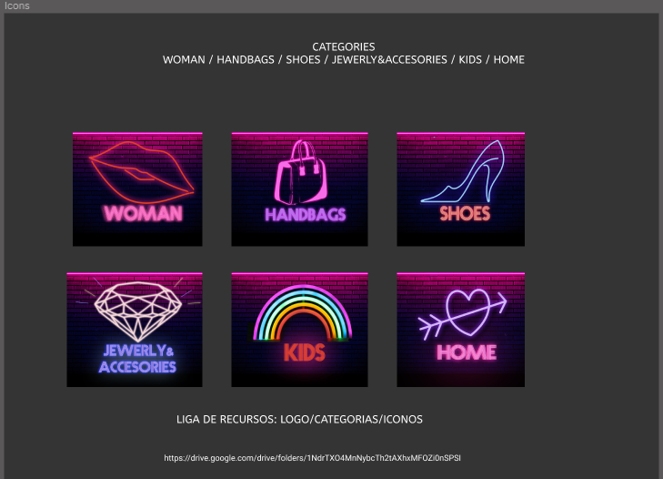

###  Functional Design Document

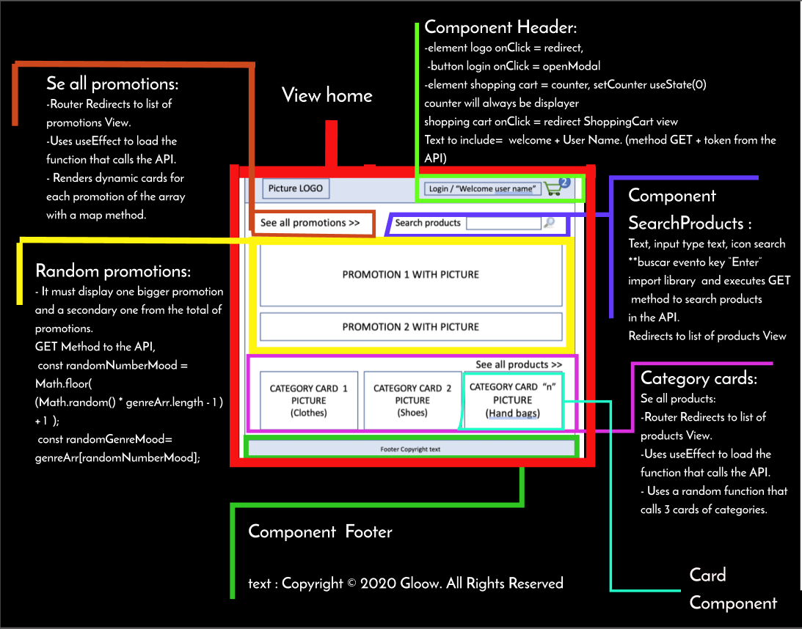
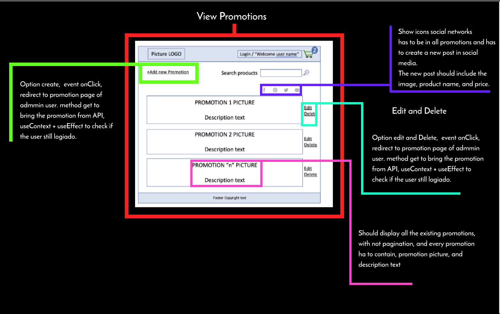

###  Finished Product

## Authors

✒️ [@Ana Paula Oliva](https://github.com/anapaulaoliva 'Repository of Ana Pau Oliva')

✒️ [@Ana Karen Ramirez](https://github.com/KARENLABO 'Repository of Karen Ramirez')

✒️ [@Bianca Cardona](https://github.com/Biancardona 'Repository of Bianca Cardona')

✒️ [@Teresa Carbajal](https://github.com/TeresaC21 'Repository of Teresa Carbajal')

✒️ [@Yaidi Garcia](https://github.com/Yaidi 'Repository of Yaidi Garcia')s
